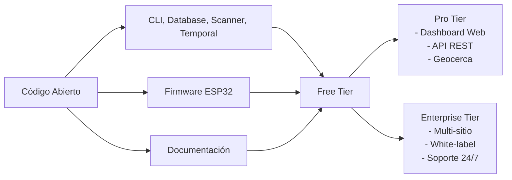

# Modelo de Precios — BalizaBT

## Filosofía de Precios

Nuestro modelo de precios refleja el principio de **accesibilidad democrática**: el posicionamiento BLE de alta precisión no debería costar $2,500 por tag. Nuestras tarifas se basan en el valor generado, no en el hardware.

---

## 1. Tiers de Suscripción

### 🆓 Free (Open Source)

**Precio**: Gratis • Código abierto bajo licencia MIT

**Perfecto para**: Desarrolladores, estudiantes, makers, POC iniciales

| Característica | Límite |
|----------------|--------|
| Dispositivos | Ilimitados (auto-gestionados) |
| Gateways | Ilimitados (auto-gestionados) |
| API | CLI local, datos SQLite |
| Dashboard web | ❌ No incluido |
| Soporte | Comunidad (GitHub Issues) |
| Actualizaciones | ✅ Continuas |
| Uso comercial | ✅ Permitido |

**Incluye:**
- Escáner BLE (simulation y hardware mode)
- Base de datos SQLite con WAL mode
- Análisis temporal y patrones
- Exportación CSV/JSON
- CLI completa
- Firmware ESP32 open source

---

### 💼 Pro

**Precio**: **$2,999/mes** • Para equipos y PYMES

**Perfecto para**: Instaladores domóticos, facility managers, small business

| Feature | Free | **Pro** |
|---------|------|--------|
| Dispositivos | Ilimitados | **Hasta 100** |
| Gateways | Ilimitados | **Hasta 5** |
| API REST | ❌ | ✅ Full |
| SDKs (Node, Python) | ❌ | ✅ |
| Dashboard web | ❌ | ✅ Multi-floor |
| Geocerca (geofencing) | ❌ | ✅ 10 zonas |
| Alertas en tiempo real | ❌ | ✅ Email, Webhook |
| Webhooks | ❌ | ✅ Ilimitados |
| Soporte | Comunidad | **Prioridad alta** |
| Integración Home Assistant | ❌ | ✅ Plugin incluido |
| Actualizaciones OTA ESP32 | CLI | ✅ GUI + OTA |

**Características Premium Pro:**
- **Dashboard web** con visualización de mapas y heatmaps
- **Geocerca** con notificaciones personalizadas
- **Alertas inteligentes** (dispositivo perdido, batería baja)
- **Exportación avanzada** a PDF, CSV, JSON
- **Integración Home Assistant** con auto-descubrimiento
- **API REST completa** con rate limits de 1,000 req/min
- **SDKs oficiales** para Node.js y Python
- **Soporte prioritario** vía tickets (24h SLA respuesta)

---

### 🏢 Enterprise

**Precio**: **$9,999/mes** • Para grandes organizaciones

**Perfecto para**: Empresas, salud, logística, retail, educación

| Feature | Pro | **Enterprise** |
|---------|-----|----------------|
| Dispositivos | Hasta 100 | **Ilimitados** |
| Gateways | Hasta 5 | **Ilimitados** |
| API rate limits | 1,000/min | **10,000/min** |
| Ubicaciones | 1 edificio | **Multi-sitio** |
| Geocerca | 10 zonas | **Ilimitadas** |
| Usuarios | Hasta 5 | **Ilimitados** |
| Soporte | Prioridad alta | **24/7 dedicado** |
| Onboarding | ❌ | ✅ Dedicado (2 semanas) |
| Custom integraciones | ❌ | ✅ Ilimitadas |
| White-label | ❌ | ✅ Branding completo |
| SLA uptime | 99.5% | **99.9%** |
| Compliance | ❌ | ✅ SOC2, GDPR, HIPAA-ready |

**Características Enterprise:**
- **Multi-tenant architecture** para franquicias y redes
- **Onboarding dedicado** con ingeniero de implementación
- **White-label completo** con custom domain y branding
- **API rate limits** de 10,000 req/min
- **Soporte 24/7** con ingenieros dedicados
- **Guaranteed SLA** de 99.9% uptime
- **Compliance** lista para SOC2, GDPR, HIPAA
- **Integraciones custom** y consulting incluido
- **Feature requests prioritarias** en roadmap

---

## 2. Precio de Hardware (Separado)

### Tags ESP32 Personalizados

| Modelo | Características | Precio unitario |
|--------|----------------|----------------|
| **ESP32-C3 SuperMini** | 160MHz, BLE 5.0, IP67 | **$3.50** |
| **ESP32-S3 Mini** | Dual-core, BLE 5.0, más RAM | $5.50 |
| **BalizaBT Beacon Pro** | Caja industrial, 2 años batería | $12.00 |

### Gateways

| Modelo | Características | Precio |
|--------|----------------|--------|
| **BalizaBT Gateway Mini** | Raspberry Pi Zero, USB BLE | $29.00 |
| **BalizaBT Gateway Pro** | RPi 4, dual BLE, Ethernet | $79.00 |
| **BalizaBT Gateway Enterprise** | Industrial, PoE, LTE backup | $299.00 |

### Comparativa con Competencia

| Vendor | Tag hardware | Precio unitario | Precio BalizaBT |
|--------|-------------|----------------|-----------------|
| Estimote | Sticker | $25–40 | **$3.50** 📉 |
| Kontakt.io | Pro | $30–50 | **$3.50** 📉 |
| Gimbal | Series 21 | $25–40 | **$3.50** 📉 |
| Radius Networks | RadBeacon | $50–100 | **$3.50** 📉 |

**Ahorro potencial: hasta 90% en hardware**

---

## 3. Pricing Add-ons

| Add-on | Precio | Descripción |
|--------|--------|-------------|
| **Instalación profesional** | $500/gateway | Configuración, montaje, calibración |
| **Consultoría de integración** | $200/hora | Conectar con sistemas existentes |
| **Capacitación en siten** | $1,500/día | Entrenamiento de equipos |
| **Soporte 24/7 Enterprise** | Incluido | SLA 15min respuesta |
| **Datos históricos archivados** | $99/mes | 2 años de datos offline |
| **Certificación de instalación** | $250 | Certificado de precisión post-calibración |

---

## 4. Modelo Open Core



---

## 5. Comparativa de ROI

### Escenario: Warehouse de 1,000 tags

| Vendor | Hardware | Software (5 años) | **Total 5 años** |
|--------|----------|-------------------|------------------|
| **BalizaBT Pro** | 1,000 × $3.50 = $3,500 | 5 × $2,999 = $14,995 | **$18,495** |
| Estimote | 1,000 × $35 = $35,000 | 5 × $5,000 = $25,000 | $60,000 |
| Kontakt.io | 1,000 × $40 = $40,000 | 5 × $6,000 = $30,000 | $70,000 |
| Gimbal | 1,000 × $30 = $30,000 | 5 × $4,000 = $20,000 | $50,000 |

**Ahorro con BalizaBT: hasta 69% vs competencia**

---

## 6. Preguntas Frecuentes sobre Precios

### ¿Puedo empezar gratis?
Sí. El tier Free es completamente funcional y gratuito. Puedes escalar a Pro cuando necesites el dashboard web o API REST.

### ¿Hay descuentos para startups?
Sí. Startups con menos de 10 empleados y revenue < $1M/año pueden solicitar **50% de descuento** en el primer año. Contacta a sales@balizabt.dev.

### ¿Qué pasa si excedo el límite de dispositivos en Pro?
Recibirás una notificación cuando te acerques al límite. Puedes upgradear a Enterprise o comprar "device packs" adicionales ($5/device/mes).

### ¿Hay contrato de por vida?
Sí, opción de pago único:
- **Pro Lifetime**: $19,999 (3 gateways, 100 tags)
- **Enterprise Lifetime**: $79,999 (ilimitado)

### ¿Puedo cancelar en cualquier momento?
Sí. Cancela cuando quieras. Los downgrades mantienen funcionalidad hasta fin de ciclo facturado.

---

## 7. Pricing Cheat Sheet (Resumen Ejecutivo)

| Necesidad | Recomendado | Precio |
|-----------|-------------|--------|
| Hobby / aprender | Free | **$0** |
| Casa inteligente | Free → Pro | **$2,999/mes** |
| PYMES / tiendas | Pro | **$2,999/mes** |
| Fábrica / almacenes | Pro → Enterprise | **$9,999/mes** |
| Multi-sitio / cadena | Enterprise | **$9,999/mes** |
| Desarrollo custom | Free + soporte dev | **$0** (+$250 consultoría) |

### Decisión Rápida

```
¿Solo quieres probar? → Free ($0)
¿Necesitas dashboard/API? → Pro ($2,999/mes)
¿Vas a escanear toda una fábrica? → Enterprise ($9,999/mes)
```

---

## 8. Comparativa de Precios: BalizaBT vs Competencia (Enterprise)

| Funcionalidad | **BalizaBT Enterprise** | Estimote | Kontakt.io | Gimbal |
|---------------|------------------------|----------|------------|--------|
| Tags hardware | $3.50/tag | $30/tag | $35/tag | $25/tag |
| Software anual | $9,999 | $20,000 | $25,000 | $15,000 |
| Open source | ✅ | ❌ | ❌ | ❌ |
| Offline mode | ✅ | ❌ | ❌ | Parcial |
| Multi-site | ✅ | $5,000 extra | $8,000 extra | $3,000 extra |
| White-label | ✅ | $10,000 | $15,000 | $8,000 |
| **Precio total (1,000 tags, 3 sitios)** | **$27,495** | $79,000 | $110,000 | $79,000 |

**BalizaBT ahorra hasta 73% vs competencia**